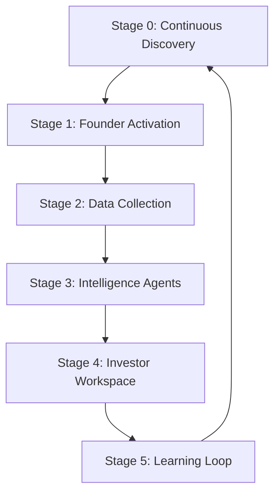
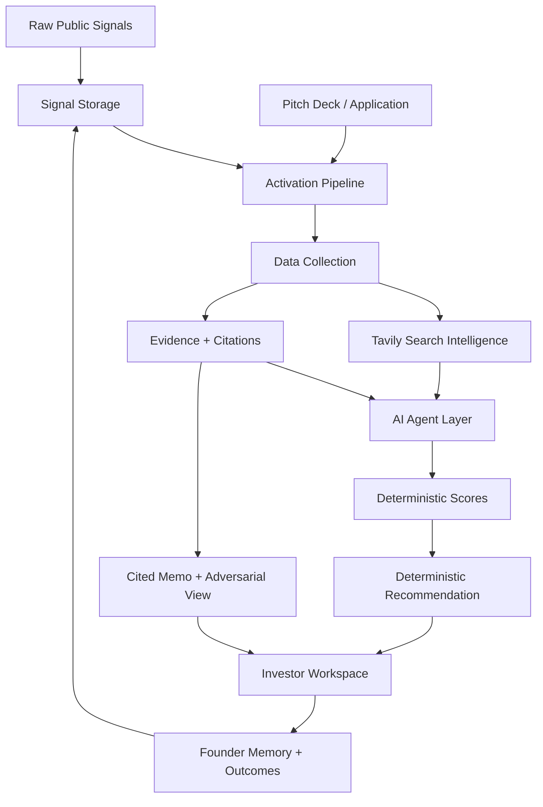
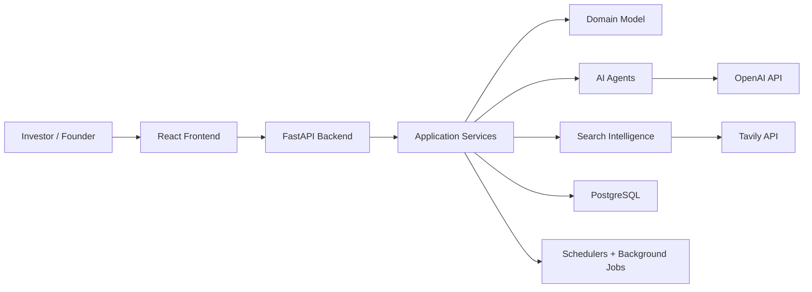
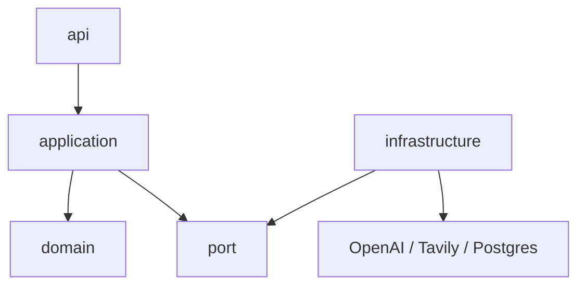
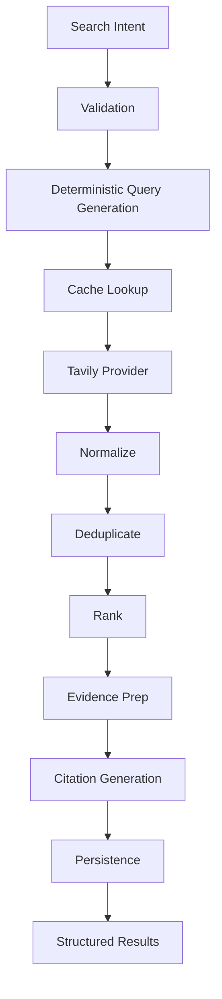

# Architecture

This document explains how The VC Brain works end to end.

## Product Philosophy

The VC Brain is an evidence-first venture intelligence system. It is designed to discover founders early, reduce network bias, and compress diligence into a decision-ready investor packet.

Core principles:

- Every factual claim must link to evidence.
- Every score must be explainable.
- Every recommendation must be reproducible.
- AI must not make hidden business decisions.
- Deterministic services own scoring, confidence, thresholds, and recommendations.
- Agents should be isolated, testable, and replaceable.
- The hackathon MVP should be impressive without becoming enterprise software.

## End-To-End Workflow



## Stage 0-5 Agent Flow

Stage 0 runs before a founder enters the product. Scanner jobs watch public sources such as GitHub, Product Hunt, Hacker News, arXiv, patent filings, and accelerator cohorts. Hits are stored as raw signals. They are not scored as opportunities yet.

Stage 1 converges inbound and outbound entry. A founder can submit a company name and pitch deck, or a Stage 0 signal can trigger outreach and activation. Both paths produce the same application/founder/company record.

Stage 2 collects heterogeneous evidence: deck claims, GitHub activity, launch reception, funding metadata, LinkedIn history, research output, patents, and accelerator records. Every artifact is timestamped and source-tagged.

Stage 3 runs specialized agents:

| Agent | Responsibility |
|---|---|
| Entity Resolution Agent | Confirms profiles and artifacts refer to the same person/company |
| Thesis Matching Agent | Compares opportunity against the fund thesis |
| Founder Agent | Evaluates founder traits, execution history, technical depth |
| Market Agent | Assesses market, competitors, SWOT, timing |
| Idea-vs-Market Agent | Stress-tests whether the idea fits the market or should pivot |
| Evidence Agent | Extracts and links evidence to claims |
| Trust Agent | Scores source quality, corroboration, contradiction, and confidence |
| Memory Update Agent | Writes durable founder and outcome memory |
| Adversarial Agent | Produces the strongest skeptical case against investment |
| Memo Agent | Drafts cited investment memo sections |

Stage 4 presents curated investor surfaces: dashboard, founder profile, company profile, evidence explorer, diligence workspace, recommendation, memo, timeline, and adversarial view.

Stage 5 records pass/invest outcomes, source quality, channel performance, feedback, and memory updates so discovery improves over time.

## Data Flow



## System Architecture



The system is a modular monolith. Modules are separated by package boundaries rather than services. This keeps local development and hackathon deployment simple while preserving future extraction paths.

## Backend Architecture

```text
backend/app/
  agents/                  Specialized agent modules
  api/                     FastAPI route, DTO, mapper, and error boundaries
  application/             Use-case orchestration
  domain/                  Business concepts and deterministic rules
  infrastructure/          External providers and technical adapters
  port/                    Provider-neutral interfaces
  repository/              Repository contracts
  entity/                  Persistence entity definitions
```

Dependency direction:



## Frontend Architecture

The frontend is organized by product feature:

```text
frontend/src/
  pages/                   Route-level screens
  features/                Feature-specific components, hooks, services, types
  api/                     API clients
  components/              Shared UI
  layouts/                 App shell
  types/                   Shared TypeScript types
```

Primary screens:

- Dashboard
- Signals
- Applications
- Founder Profile
- Company Profile
- Evidence Explorer
- Diligence Workspace
- Recommendation
- Investment Memo
- Adversarial Review
- Timeline
- Learning

## Database Overview

The database uses PostgreSQL. Stable entities are relational. AI/search artifacts use structured JSON where schemas are expected to evolve.

Main table families:

- discovery signals and scanner runs
- applications and pitch uploads
- companies and founders
- sources, citations, claims, evidence
- search runs, generated queries, results, cache entries
- agent runs and outputs
- scorecards and score components
- recommendations, memos, adversarial reviews
- founder memory, outcomes, feedback, channel performance, source quality

Migration areas are grouped by workflow stage under `database/migrations/`.

## Search Architecture

Tavily is the default Search Intelligence provider. Agents do not call Tavily directly.



Search results include source URL, normalized URL, title, snippet, author, publication date, domain, query, confidence, relevance score, category, language, retrieval timestamp, citation ID, raw response, and structured metadata.

Future providers such as Google, Brave, and Exa can implement the `SearchProvider` port while Tavily remains the default.

## AI Architecture

AI is used for:

- query planning
- claim extraction
- claim verification
- entity resolution assistance
- thesis matching assistance
- memo drafting
- adversarial review

AI is not used for final deterministic scoring or hidden investment decisions.

Structured Outputs are preferred. Every AI response should be validated before persistence or downstream use.

## Memory Architecture

Memory is the durable learning layer:

- raw signals from Stage 0
- founder history across companies and pitches
- evidence and trust history
- prior pass/invest outcomes
- channel performance
- source quality
- feedback events
- learning signals

Memory updates happen after agent runs and investor decisions. Stage 5 feeds Stage 0 so future discovery improves.

## Security Considerations

MVP security:

- environment-only secrets
- no secrets in Git
- input validation on APIs and DTOs
- safe Markdown rendering
- bounded upload handling for pitch decks
- request timeouts for external providers
- optional API key protection
- CORS restricted by environment

## Scalability Considerations

The modular monolith is sufficient for the hackathon. Scale pressure will first appear in:

- scanner jobs
- external API rate limits
- search cache size
- agent queue execution
- evidence storage

Future scaling path:

1. add queue-backed background execution
2. isolate scanner workers
3. introduce Redis for hot cache
4. add vector search for evidence retrieval
5. extract search or agent execution only if operationally necessary

## Design Rationale

The system chooses simplicity at runtime and rigor at boundaries. The repo keeps one backend and one frontend, but separates domain, application, infrastructure, agents, and ports. This gives the team clear implementation paths without microservice overhead.
