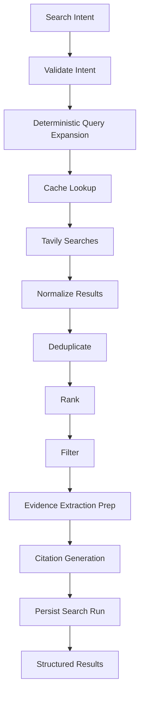
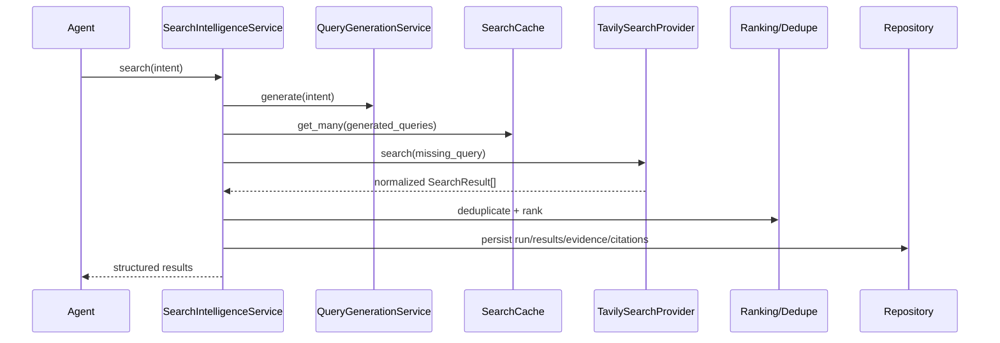

# Tavily Search Intelligence Architecture

Tavily is the default web intelligence provider for The VC Brain. It is not called directly by agents. Agents call the provider-neutral Search Intelligence service, which handles deterministic query generation, caching, retries, deduplication, ranking, evidence preparation, citation generation, persistence, and observability.

## Package Architecture

```text
backend/app/application/search_intelligence/
  pipeline/
  query_generation/
  ranking/
  deduplication/
  evidence_extraction/
  citation/
  cache/
  metrics/
  validation/

backend/app/domain/search_intelligence/
  query/
  result/
  evidence/
  citation/
  cache/
  provider/
  metrics/

backend/app/port/search/
  search_provider.py
  search_cache.py

backend/app/infrastructure/search/tavily/
  client/
  config/
  exceptions/
  mapper/
  retry/
```

## Data Flow



## Sequence



## Query Generation Strategy

User text is never sent directly to Tavily. The system converts company, founder, technology, industry, market, stage, country, thesis, and recent-event fields into deterministic query templates.

Example for a company:

- `{company} funding news`
- `{company} enterprise customers`
- `{company} recent partnerships`
- `{company} competitors`
- `{company} Product Hunt`
- `{company} Hacker News`
- `{company} GitHub repositories`
- `{company} market size`

Each generated query receives a deterministic key based on category and query text.

## Ranking Strategy

Final ranking should combine:

- Tavily relevance score
- source trust score
- recency
- category match
- source diversity
- evidence specificity

The current skeleton reserves `SearchRankingService` for this deterministic formula.

## Deduplication Strategy

Dedupe in this order:

1. normalized URL
2. canonical domain/path
3. title similarity
4. snippet similarity
5. provider result identity

The MVP skeleton implements normalized URL dedupe first.

## Cache Strategy

Cache keys:

- `search:v1:{category}:{normalized_query}`
- `result:v1:{normalized_url}`
- `evidence:v1:{result_hash}`

TTL recommendations:

- funding/startup news: 24 hours
- customer and product signals: 3 days
- founder/company background: 7 days
- market and academic research: 14 days
- patent and accelerator records: 30 days

High-priority companies are refreshed by `SearchRefreshJob`.

## Persistence Strategy

Persist:

- search runs
- generated queries
- provider requests
- normalized results
- extracted evidence
- citations
- cache entries
- metrics snapshots

Database migrations live under `database/migrations/stage2_data_collection` and `database/migrations/stage3_intelligence`.

## Retry And Error Handling

Handle:

- rate limits with bounded exponential backoff
- timeouts with retry and partial results
- empty results with query refinement
- malformed responses with provider error classification
- network failures with graceful degradation to cache

## Observability

Log and measure:

- every search run
- generated query count
- cache hit ratio
- provider duration
- API usage
- retries
- failures
- confidence distribution

## Agent Integration

Stage 0 discovery agents use search for scanner enrichment.

Stage 2 data collection uses search to gather source-backed artifacts.

Stage 3 agents use search results as evidence input:

- Founder Agent: founder background and execution signals
- Market Agent: market size, competitors, trend evidence
- Idea-vs-Market Agent: product validation and customer signals
- Evidence Agent: claim corroboration
- Trust Agent: source quality and contradiction checks
- Recommendation Engine: evidence-backed scoring context
- Memo Agent: citations and source appendix

## Extension Points

Agents depend on `SearchProvider`, not Tavily directly. Future providers should implement `backend/app/port/search/search_provider.py`:

- Google
- Brave
- Exa

Tavily remains the default implementation.

